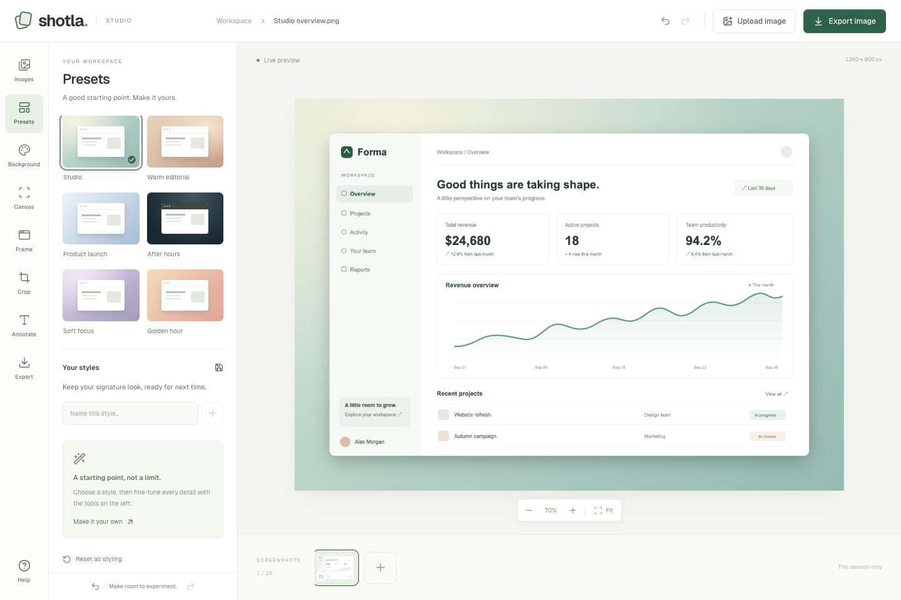

# Shotla Studio

Turn screenshots into polished visuals with coordinated presets, backgrounds, frames, crops, and annotations. Shotla keeps the tools in one sidebar and renders the result directly in your browser.



Built with Next.js 15, React 19, TypeScript, Tailwind CSS 4, and Bun. Manual editing needs no account or API key.

## Run locally

Install [Bun](https://bun.sh/), then clone and start the project. Local checks and GitHub Actions use Bun 1.3.11.

```sh
git clone https://github.com/akkikumar72/shotla.git
cd shotla
bun install --frozen-lockfile
bun run dev
```

Open [localhost:3000](http://localhost:3000), upload an image, or select **Try a demo**. To use another port: `bun run dev --port 3100`.

```sh
bun run check   # TypeScript, scoped lint/format, regression tests, production build
bun run start  # Serve the production build
```

Development uses `.next-dev`; production uses `.next`, so a production build does not overwrite an active development server's output.

## Editing workflow

1. Upload, drop, or paste a screenshot. Each image keeps its own edits and undo history.
2. Choose a preset, then adjust its background, canvas dimensions, and frame.
3. Crop the image or add a caption and magnifier to highlight a detail.
4. Choose a filename, format, and resolution. Download the rendered result or copy it as PNG.

## Workspace

Every editing feature is accessible from the sidebar:

| Tool | What it does |
| --- | --- |
| Images | Upload, switch, remove, and try a sample. Each image has its own editing state and undo history. |
| Presets | Six coordinated styles and up to eight named styles saved in this browser. |
| Background | 51 backgrounds, search, patterns, custom colors/gradients, editable hex values, transparency, grain, and optional AI styling. |
| Canvas | Natural-size fitting, custom dimensions, aspect ratios, social formats, padding, corners, image transforms, and preview zoom. |
| Frame | No header or light/dark window headers, shadow, corners, borders that preserve the image area, scale, and position. |
| Crop | Interactive crop, cancel, and restore original. Cropping is undoable. |
| Annotate | Editable captions that fit the canvas and magnifiers with actual zoomed image content, seven positions, size, color, and focus controls. |
| Export | PNG, JPEG, WebP, 1×/2×/3× resolution, file naming, PNG clipboard copy, and a persistent rendered preview with a Download again link. |
| Help | Workflow, keyboard shortcuts, and storage behavior. |

Undo and redo are also available in the sidebar footer. On small screens, the settings button shows or hides the inspector so the preview stays accessible.

| Shortcut | Action |
| --- | --- |
| Cmd/Ctrl+V | Paste an image |
| Cmd/Ctrl+Z | Undo |
| Shift+Cmd/Ctrl+Z | Redo |
| Escape | Cancel cropping |

## Storage and privacy

Images remain in the current tab and are **not saved across refreshes**. Export before closing. Only named style settings persist in local storage. There is no cloud upload in the ordinary editing/export flow.

## Limits

- Up to 10 images, 20 MB per file, and 40 million source pixels per image.
- PNG, JPG, WebP, GIF, and AVIF imports. Animated formats are flattened to one frame.
- Custom canvas sides are 100–4096 px. Natural-fit images are scaled down if needed to fit the 4096 px canvas limit.
- Export resolution is capped at 8192 px per side. JPEG flattens transparency to white.
- Clipboard image copying needs browser support and a secure context (localhost is supported).

## Optional AI styling

Set `OPENAI_API_KEY` in `.env.local` and restart the server. The sidebar enables AI styling only when the key is configured. Clicking it sends a reduced PNG of the active screenshot to OpenAI; the interface discloses this. The key stays on the server. Manual editing and presets require no key.

Provider-backed generation needs separate testing with a valid key. No AI credentials are included in this repository.

## Development and verification

| Command | Purpose |
| --- | --- |
| `bun run dev` | Development server |
| `bun run build` / `bun run start` | Build and serve production |
| `bun run typecheck` | TypeScript validation |
| `bun run lint` / `bun run format:check` | Biome checks for the editor implementation |
| `bun run format` | Apply Biome formatting and safe fixes |
| `bun run test` | Geometry, crop, background, and history regressions |
| `bun run check` | Typecheck, lint, format, tests, and production build |

[GitHub Actions](.github/workflows/quality.yml) runs the frozen-lockfile install and `bun run check` on pull requests and pushes to `master`.

The latest local validation passes **13 regression tests** and a production build. Browser audits exercised all nine sidebar tools, all six presets, all 51 backgrounds, mobile layouts, crop recovery, annotation placement, and PNG/JPEG/WebP at every 1×/2×/3× resolution. Transparency and clipboard output were inspected from decoded image pixels.

- [UI audit](docs/ui-audit.md): original findings, competitor research, and the initial browser checks.
- [Uploaded-image audit](docs/uploaded-image-audit.md): clipping, color, and grain-export fixes verified with an uploaded image.
- [Browser audit results](docs/browser-audit-results.json): recorded results from the initial 79 checks.

The Codex in-app browser's native file-save handoff could not be confirmed. Its encoded exports and clipboard PNGs were verified; ordinary Chrome downloads passed the initial audit. AI-provider requests still need separate validation with a configured key.

`scripts/browser-audit.js` is a Playwright CLI `run-code --filename` scenario for the production preview on port 3101. It requires a separate, isolated browser session with an empty workspace and AI unconfigured. See the [reproduction steps](docs/ui-audit.md#reproduce-the-browser-check). Generated exports and screenshots stay under ignored `output/playwright/`; browser automation is not part of the default CI job.

Before opening a pull request, run `bun run check`. For UI changes, also verify the affected controls in a browser at desktop and mobile sizes.

The included Forma dashboard and README preview use original fictional demo content. Uploaded user images and local audit exports are not included in the repository.
