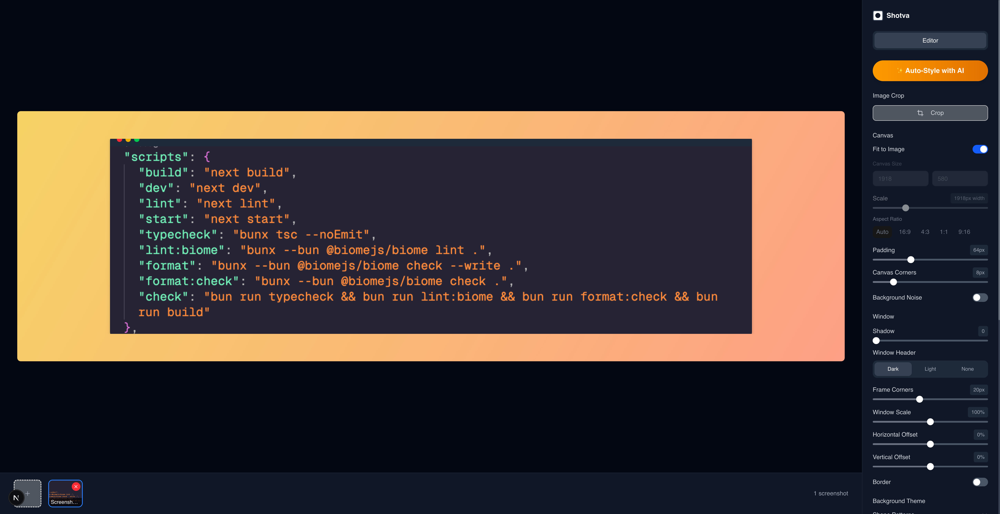

# 📸 Shotla

**Modern Screenshot Editor with AI-Powered Styling**

Transform your screenshots into stunning visuals with professional backgrounds, smart cropping, and AI-enhanced styling.



## ✨ Features

- 🎨 **Beautiful Backgrounds** - 60+ gradient and pattern themes
- ✂️ **Smart Cropping** - Precise image cropping with live preview
- 🔍 **Magnifiers** - Highlight important areas with zoom effects
- 📝 **Text Overlays** - Add custom text with full styling control
- 🤖 **AI Auto-Styling** - Intelligent background and styling suggestions
- 🖼️ **Multi-Screenshot** - Manage and edit multiple images
- ⚙️ **Advanced Controls** - Fine-tune shadows, borders, and spacing
- 📱 **Responsive Design** - Works seamlessly on all devices
- 💾 **High-Quality Export** - Export in multiple formats and resolutions

## 🚀 Quick Start

### Prerequisites

Ensure you have [Bun](https://bun.sh/) installed:

```bash
curl -fsSL https://bun.sh/install | bash
```

### Installation

1. **Clone the repository**

   ```bash
   git clone https://github.com/yourusername/shotla.git
   cd shotla
   ```

2. **Install dependencies**

   ```bash
   bun install
   ```

3. **Start development server**

   ```bash
   bun run dev
   ```

4. **Open your browser**
   Navigate to [http://localhost:3000](http://localhost:3000)

## 🛠️ Tech Stack

- **Framework:** Next.js 14 with App Router
- **Runtime:** Bun
- **Styling:** Tailwind CSS + shadcn/ui
- **Language:** TypeScript
- **AI Integration:** OpenAI API
- **Image Processing:** HTML Canvas + html-to-image
- **Icons:** Lucide React

## 🎯 Usage

### Basic Workflow

1. **Upload Screenshot** - Drag & drop or click to select your image
2. **Choose Background** - Pick from gradients, patterns, or solid colors
3. **Adjust & Style** - Use cropping, scaling, and positioning tools
4. **Add Enhancements** - Insert text, magnifiers, or apply AI styling
5. **Export** - Download your styled screenshot in high quality

### Key Features

#### 🎨 Background Themes

- **Gradients:** 30+ carefully crafted color combinations
- **Patterns:** Abstract and geometric SVG patterns
- **Solid Colors:** Clean, professional single-color backgrounds

#### ✂️ Cropping & Editing

- Interactive crop overlay with precise controls
- Real-time preview of changes
- Non-destructive editing workflow

#### 🤖 AI Auto-Styling

- Intelligent background suggestions based on image content
- Automatic color palette matching
- Smart layout optimization

## 📦 Scripts

```bash
# Development
bun run dev          # Start development server
bun run build        # Build for production
bun run start        # Start production server

# Code Quality
bun run lint         # Run Next.js linter
bun run typecheck    # TypeScript type checking
bun run format       # Format code with Biome
bun run check        # Run all quality checks
```

## 🤝 Contributing

We welcome contributions! Here's how to get started:

1. Fork the repository
2. Create a feature branch (`git checkout -b feature/amazing-feature`)
3. Commit your changes (`git commit -m 'Add amazing feature'`)
4. Push to the branch (`git push origin feature/amazing-feature`)
5. Open a Pull Request

### Development Guidelines

- Use Bun for all package management and script execution
- Follow the existing TypeScript and React patterns
- Ensure your code passes all quality checks: `bun run check`
- Add appropriate tests for new features

## 📄 License

This project is licensed under the MIT License - see the [LICENSE](LICENSE) file for details.

## 🙏 Acknowledgments

- [shadcn/ui](https://ui.shadcn.com/) for the beautiful UI components
- [Lucide](https://lucide.dev/) for the icon system
- [Tailwind CSS](https://tailwindcss.com/) for the styling framework
- [Bun](https://bun.sh/) for the lightning-fast JavaScript runtime

---

<div align="center">
  Made with ❤️ by @akkikumar
</div>
